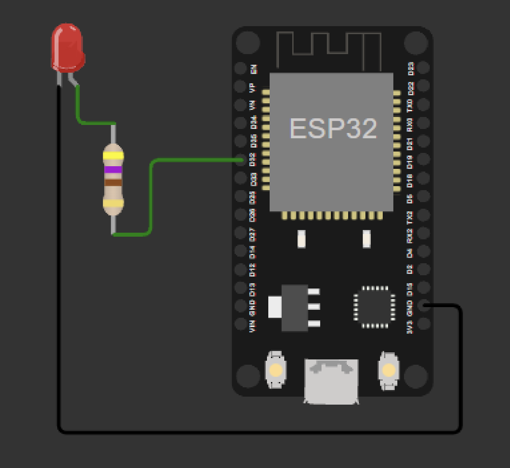
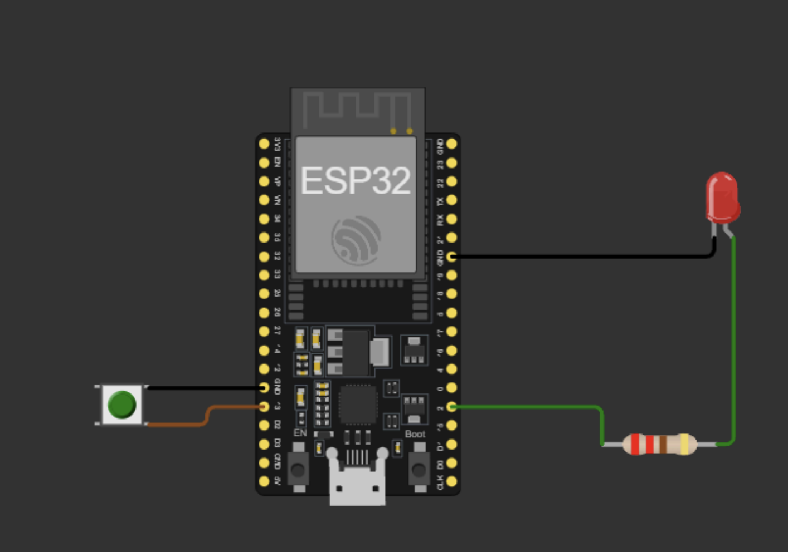
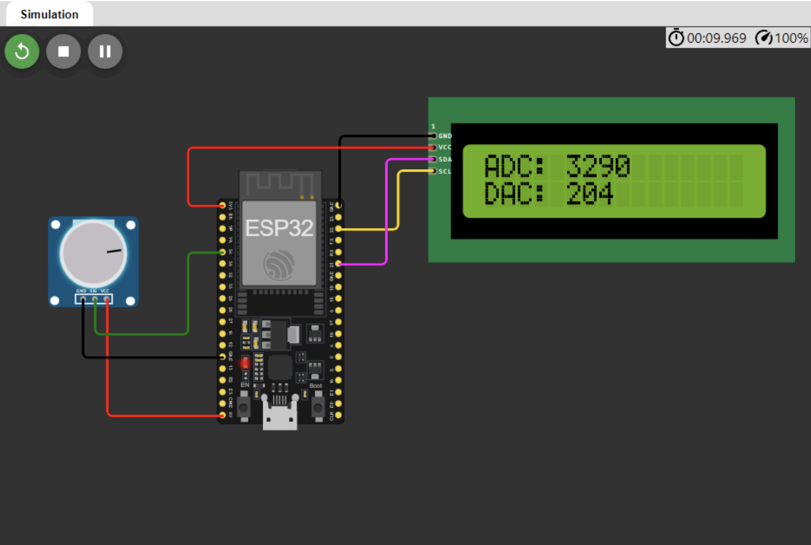

# Atividade Semanal 9

Alunos:
- Lucas Lima Romero (13676325)
- Marco Antonio Gaspar Garcia (11833581)

Questão 1)

**LED_blink** (apresentar linhas de código utilizando o **framework nativo Espressif IDE** para blink de um LED – escolher qualquer pino de GPIO para ligar o LED e piscar a cada 500 ms).

R: 

Utilizando os exemplos fornecidos pelo professor, o circuito deste exercício foi montado e pode ser visto na figura à seguir.
<figure>
  
  <figcaption>Figura 1:  Circuito do primeiro exercício LED_blink.</figcaption>
</figure>

Para resolver o exercício, utilizamos o seguinte código, onde foi definindo o pino 32 como o pino de saída e um delay de 500ms para o piscar do LED.

```c
#define ledpin 32

void setup() { 
  // configuração inicial
  
  pinMode(ledpin, OUTPUT); // define o pino como saída
  digitalWrite(ledpin, LOW); // mantém o LED apagado inicialmente
}

void loop() { 
  // programa principal
  
  digitalWrite(ledpin, HIGH);  // liga o LED
  delay(500); // espera 500 ms
  digitalWrite(ledpin, LOW);   // desliga o LED
  delay(500); // espera 500 ms
}
```

Questão 2)

**timer_interrupt** (montar o projeto no simulador Wokwi e testar o programa
disponibilizado na pasta de exemplos). 

R:

Para o segundo exercício, utilizamos o mesmo procedimento. Primeiro montamos o circuito no Wokwi, e este pode ser visto na figura a seguir. 

<figure>
  
  <figcaption>Figura 2:  Circuito do segundo exercício timer_interrupt.</figcaption>
</figure>

O código do exercício pode ser visto a seguir. Nele, definimos os pinos 2 para o LED e 13 para o botão. Além disso, definimos o delay de 500ms para o piscar do LED.

```c
#include <Arduino.h> // Biblioteca Arduino para APIs no Wokwi

const int ledPin = 2;       // LED no GPIO2
const int buttonPin = 13;   // Botão no GPIO13

hw_timer_t *timer = NULL;   // Ponteiro para o timer

volatile bool startBlink = false; // Flag para início do piscar do LED

// Interrupção do botão
void IRAM_ATTR onButtonPress() {
  startBlink = true; // Ativa o piscar do LED
}

// Interrupção do timer
void IRAM_ATTR onTimer() {
  digitalWrite(ledPin, !digitalRead(ledPin)); // Alterna o estado do LED
}

void setup() {
  Serial.begin(115200); // Comunicação serial

  pinMode(ledPin, OUTPUT);        // Pino do LED como saída
  pinMode(buttonPin, INPUT_PULLUP); // Botão com pull-up interno

  attachInterrupt(digitalPinToInterrupt(buttonPin), onButtonPress, FALLING); // Interrupção no botão

  timer = timerBegin(0, 80, true); // Configura timer com prescaler 80
  timerAttachInterrupt(timer, &onTimer, true); // Liga o timer à função onTimer
  timerWrite(timer, 500000); // Interrupções a cada 500 ms
  timerStop(timer);          // Timer começa desativado
}

void loop() {
  if (startBlink) { 
    timerStart(timer); // Inicia o piscar do LED
    startBlink = false; 
  } else {
    timerStop(timer);          // Para o piscar do LED
    digitalWrite(ledPin, LOW); // Desliga o LED
  }
}
```

Questão 3)

**ADC_DAC_Pot_LCD** (montar o projeto no simulador Wokwi e testar o programa inserir as bibliotecas necessárias). Explorar o recurso de comunicação I2C por meio do display LCD I2C e de leituras analógicas com ADC e DAC da ESP32 utilizando programas de exemplo disponibilizados.

R:

Neste exercício, foi montado o circuito conforma a figura a seguir. Além disso, a figura mostra o circuito já funcionando com o código do exercício.

<figure>
  
  <figcaption>Figura 3:  Circuito do terceiro exercício ADC_DAC_Pot_LCD.</figcaption>
</figure>

O código referente ao circuito acima é mostrado a seguir. Nele, definimos os pinos utilizados para leitura do potenciômetro (ADC) e saída analógica (DAC), configuramos a comunicação serial e o display LCD para exibir os valores lidos e mapeados, e utilizamos um loop para ler o valor analógico do potenciômetro, mapear para a escala do DAC e exibir esses valores tanto no LCD quanto na porta serial.

```c
#include <Arduino.h>          // Biblioteca para funções do Arduino
#include <Wire.h>             // Comunicação I2C
#include <LiquidCrystal_I2C.h> // LCD I2C

// Pinos
const int potPin = 34; // ADC
const int dacPin = 25; // DAC

// Variáveis
int adcValue = 0; // Valor do ADC
int dacValue = 0; // Valor do DAC

// Configuração do LCD
const int lcdAddress = 0x27; 
const int lcdColumns = 16;
const int lcdRows = 2;
LiquidCrystal_I2C lcd(lcdAddress, lcdColumns, lcdRows);

void setup() {
  Serial.begin(115200); // Inicia comunicação serial
  Serial.println("ESP32 ADC to DAC Example");

  lcd.init();          // Inicia o LCD
  lcd.backlight();     // Liga a luz de fundo
  pinMode(potPin, INPUT); // Define o potenciômetro como entrada
}

void loop() {
  adcValue = analogRead(potPin); // Lê o potenciômetro
  dacValue = map(adcValue, 0, 4095, 0, 255); // Mapeia para DAC
  dacWrite(dacPin, dacValue); // Escreve no DAC

  lcd.clear();                // Atualiza LCD
  lcd.setCursor(0, 0);
  lcd.print("ADC: ");
  lcd.print(adcValue);
  lcd.setCursor(0, 1);
  lcd.print("DAC: ");
  lcd.print(dacValue);

  Serial.print("ADC: ");      // Exibe na serial
  Serial.print(adcValue);
  Serial.print(" | DAC: ");
  Serial.println(dacValue);

  delay(100); // Aguarda
}
```
Questão 4)

Descreva de forma sucinta como funcionam os timers, interrupções, ADC e DAC na ESP32 e quais as diferenças em relação a esses recursos no PIC18F4450.

R:

**Timers e Interrupções**
- **ESP32**: Os timers no ESP32 são baseados em hardware e oferecem alta precisão, podendo operar em frequências elevadas (até 80 MHz). Eles podem gerar interrupções periódicas e são configuráveis para diversas aplicações. Interrupções podem ser associadas a GPIOs, timers e outros periféricos, com suporte a múltiplas fontes simultâneas devido à arquitetura multicore.
- **PIC18F4450**: Os timers no PIC18F4450 são mais simples e operam em frequências limitadas ao clock do microcontrolador. Suas interrupções também são básicas, com prioridade limitada e menor flexibilidade comparada ao ESP32.

**ADC (Conversor Analógico-Digital)**
- **ESP32**: Possui ADCs de 12 bits com até 18 canais e maior resolução (0-4095), permitindo leitura de sinais analógicos em várias entradas simultaneamente. Oferece maior flexibilidade e integração com outras funções, como Wi-Fi e Bluetooth.
- **PIC18F4450**: Tem ADC de 10 bits com até 13 canais, oferecendo menor resolução (0-1023). É funcional, mas menos avançado e com menor taxa de conversão comparado ao ESP32.

**DAC (Conversor Digital-Analógico)**
- **ESP32**: Inclui DACs integrados (8 bits, 2 canais) para gerar sinais analógicos diretamente, algo útil para controle de dispositivos e geração de formas de onda.
- **PIC18F4450**: Não possui DAC integrado, sendo necessário um módulo externo para essa funcionalidade, limitando sua capacidade de gerar sinais analógicos diretamente.

**Diferenças Gerais**
- O **ESP32** oferece maior capacidade de processamento, resolução superior em ADC, recursos integrados como DAC e Wi-Fi/Bluetooth, além de timers mais avançados.
- O **PIC18F4450**, embora confiável, é mais limitado e adequado para aplicações menos complexas. Sua simplicidade pode ser uma vantagem em projetos com baixo consumo ou custo reduzido.
