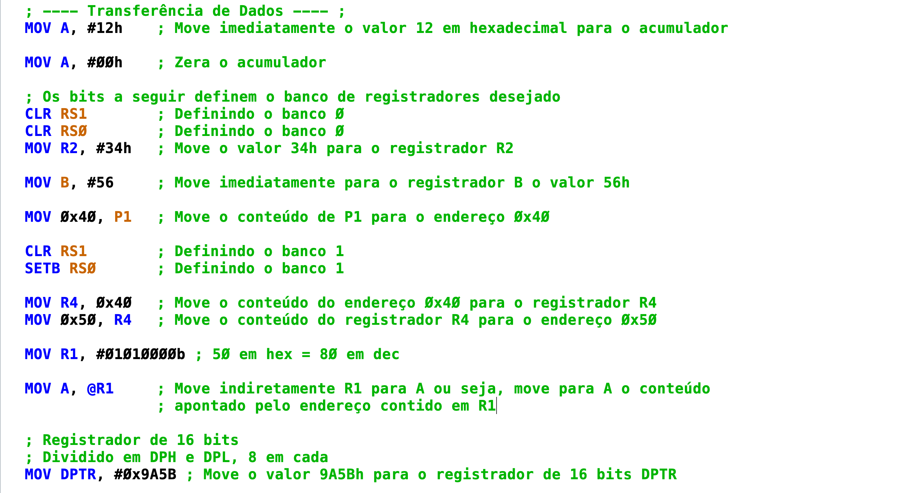
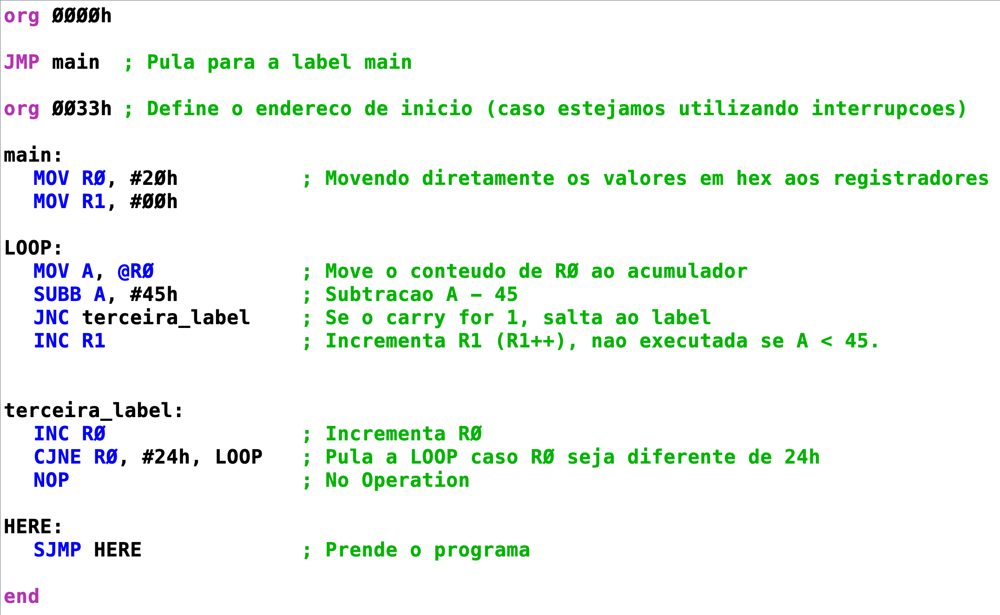

# Atividade Semanal 4

Alunos:
- Lucas Lima Romero (13676325)
- Marco Antonio Gaspar Garcia (11833581)

**OBS: Os códigos referentes à atividade estão na pasta *"Códigos"* (atv4_1.asm e atv4_2.asm)**
## Parte 1
### Sobre Transferência de Dados:

**(a) Qual foi o tempo gasto em cada linha de instrução e quantos ciclos de máquina esse programa contém? Justifique sua resposta.**

R: Cada linha de instrução gastou 1 µs, exceto pelas linhas marcadas por "2 µs":

    MOV A, #12h         ;
	MOV A, #00h         ;
	CLR RS1 		    ; 
	CLR RS0             ;
	MOV R2, #34h        ;
	MOV B, #56          ;   2 µs -> O acesso ao registrador especial B requer dois ciclos de máquina
	MOV 0x40, P1 	    ;   2 µs -> Mover de um registrador para a memória requer dois acessos
	CLR RS1 		    ;
	SETB RS0            ;
	MOV R4, 0x40 	    ;   2 µs -> Mover da memória para um registrador requer dois acessos
	MOV 0x50, R4 	    ;   2 µs
	MOV R1, #01010000b  ;
	MOV A, @R1 	        ;
	MOV DPTR, #0x9A5B   ;   2 µs -> O valor imediato é salvo em dois registradores (dois acessos)

Totalizando 19 Ciclos de máquina. Cada instrução, por padrão de sistemas RISC, custa um ciclo de máquina para ser executada. Entretanto, instruções como mover de registrador para um endereço de memória, requerem dois acessos convencionais, por isso custam dois ciclos de máquina para serem executadas. Além disso, mover para o registrador DPTR custa dois acessos, pois o valor de 16 bits é salvo em dois registradores de 8 bits.
   
**(b) O que aconteceu ao mover uma porta inteira de 8 registradores (ex.: MOV A, P1) para um destino e por que seu valor é FF?**

R: Isso se deve ao fato do estado inicial da porta. No caso do simulador, o valor inicial ou padrão das portas P0 a P1 é FF.
   
**(c) Qual valor apareceu no acumulador após ter movido R1 de forma indireta para ele?**

R: O valor que apareceu foi FF. A explicação disso é que a transferência de valor indireta ocorre como ponteiros para endereços de memória. Primeiramente, o valor armazenado no registrador R1 era 0x50. Sendo assim, ao executar "MOV A, @R1", o valor contido em R1 se torna um ponteiro para o valor desejado. Então, procura-se o valor contido no endereço 0x50, que era FF, atribuido anteriormente no programa. 
   
**(d) Por que foi possível mover um valor de 4 dígitos para DPTR? Em quais registradores especiais do simulador foi possível verificar mudanças quando essa operação foi realizada? Qual o maior valor que pode ser movido para DPTR em hexadecimal?**

R: Isso ocorreu pois DPTR consiste em dois registradores, de 8 bits, DPH e DPL. A linha executada foi "MOV DPTR, #0x9A5B", com a intenção de armazenar este valor de 16 bits. O resultado disso foi que a primeira parte do número, "9A", ficou armazenada no registrador DPH, e a segunda parte, "5B", ficou armazenada no registrador DPL. Assim, com dois registradores, é possível armazenar um valor de 16 bits em uma arquitetura de 8 bits.
   

### Sobre Instruções Aritméticas:

**(e) Faça os seguintes testes em um programa a parte:**

1. **Por que ao mover o valor 4 para ACC, o bit menos significativo de PSW resulta em 1; e ao mover o valor 3, esse bit resulta em 0?**

R: Essa diferença ocorre devido a quantidade de bits 1 no valor movido a PSW. O bit menos significativo de PSW é o bit de paridade, que é 1 caso a contagem de bits 1 do valor movido seja ímpar, e 0, caso seja par. No caso, 4 em binário é 00000100 (8bits), contém um número ímpar de bits 1, significando que o bit de paridade vale 1. Já com o valor 3 em binário, 00000011, a contagem de bits 1 é par, portanto, resulta em 0 no bit de paridade.

2. **Tente decrementar 1 unidade de algum registrador ou endereço de memória cujo valor é igual a zero (ex.: DEC A, DEC Rn, ou DEC 60h, sendo A, Rn, ou 60h iguais a zero). Por que a operação resulta em FF?**

R: Isso ocorre devido ao comportamento da aritmética binária em um sistema de 8 bits. Ao tentar decrementar o valor zero (00), não gera um valor negativo, pois é uma aritmética modular. Muitas abstrações reservam um dos bits para representar o sinal do valor, como em C por exemplo (ao utilizar "unsigned", esse comportamento é ignorado). Esse não é o caso do MCS-51, que ao decrementar o valor zero, que é o limite inferior, é como se desse uma volta e regressasse ao limite superior (FF).

## Parte 2

 O programa inicia com R0 = 20h e R1 = 0. Entao, na label LOOP, move-se de forma indireta R0 para o acumulador, significando que agora o acumulador guarda aquilo que era guardado no endereço 20h, que era o valor contido em R0. Depois, Subtrai-se 45h do valor contido no acumulador. Caso o resultado seja negativo, o carry associado em PSW sera 1, e 0 caso seja positivo. Logo, o programa pula para a terceira_label, caso o carry seja 0 (Jump Not Carry), nao incrementando R1. Caso o valor seja negativo, ou seja, carry 1, ainda em LOOP, R1 eh incrementado, pois não houve salto. Na terceira_label, incrementa-se R0 e realiza-se uma operacao de voltar a LOOP caso R0 seja diferente de 24. Assim, novamente, agora ao acumulador A será movido o valor contido no proximo endereço de memória, e o ciclo reinicia, testando a subtração de A com 45h. Caso R0 = 24h, o programa se encerra.

Em resumo, o programa procura (24h - R0) vezes valores menores que 45h, nas posicoes apontadas por R0. A cada ciclo, R0 eh incrementado, e o programa procura em posicoes sequenciais. Caso o valor apontado seja menor que 45h, eh incrementado R1, portanto, R1 salva a quantidade de valores encontrados menores que 45h, nas posicoes apontadas por R0. 

