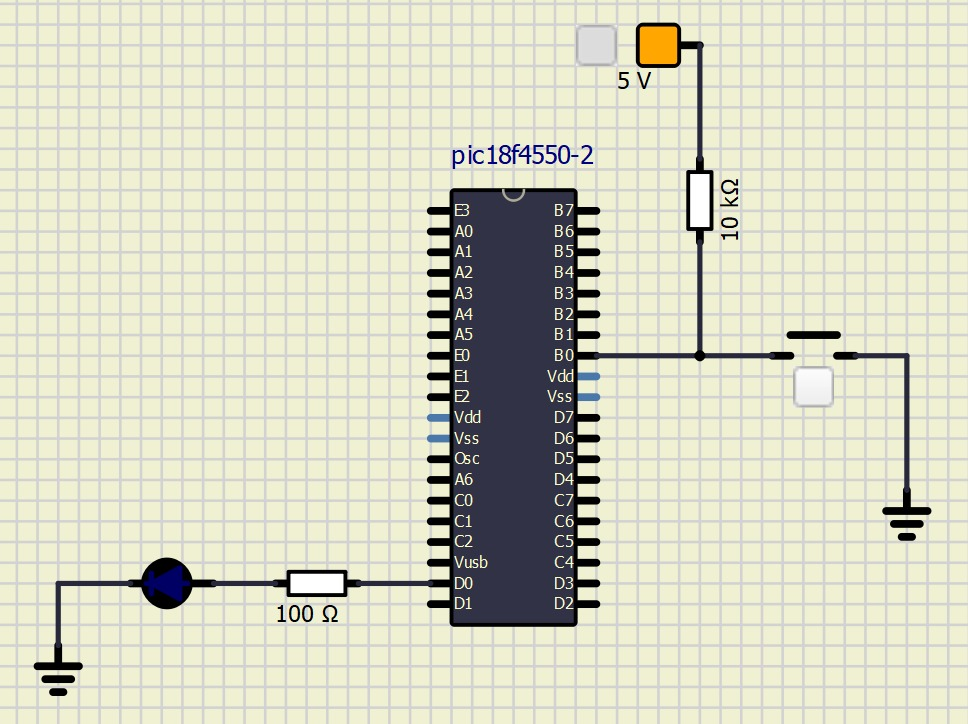
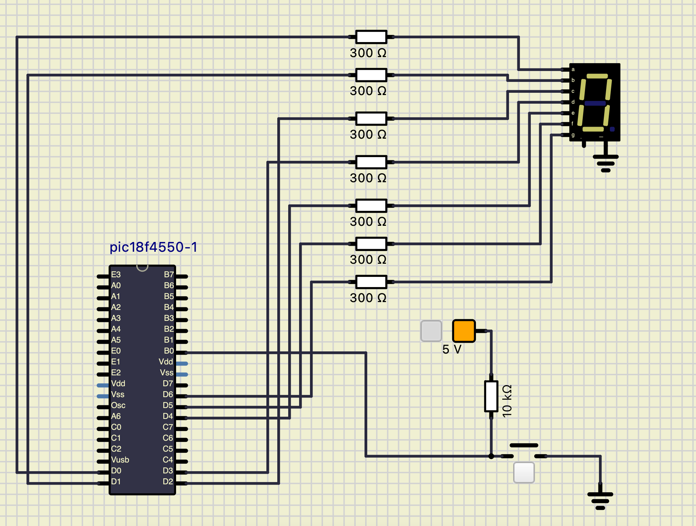

# Atividade Semanal 6

O código referente a primeira parte do exercício, que consiste em fazer o LED piscar conforme o acionamento do botão com PIC 18F4550, está disponível em ~/Códigos/atividade6_1.c. Aplicamos o tratamento do efeito bounce e aumentamos o delay para 500ms. O circuito referente ao código pode ser visto na figura 1.

<figure>
  
  <figcaption>Figura 1: Circuito referente a primeira parte do exercício.</figcaption>
</figure>

Já a segunda parte do exercício consiste em montar um circuito para acender um display de 7 segmentos, também utilizando PIC 18F4550. O circuito montado pode ser visto na figura 2, e o código pode ser visto em ~/Códigos/atividade6_2.c, no repositório.

<figure>
  
  <figcaption>Figura 2: Circuito referente a segunda parte do exercício.</figcaption>
</figure>

# Comparação PIC18F4550 e AT89S51

A seguir, vamos fazer uma breve comparação do PIC18F4550 com aquele que usamos anteriormente AT89S51, analisando aquilo que mais difere entre os dois. Vamos separar nossa análise em alguns eixos:

**1. Arquitetura**

_PIC18F4550:_ Baseado na arquitetura Harvard modificada, separando memória de programa e memória de dados, o que permite acessos simultâneos e maior eficiência. Utiliza um conjunto de instruções RISC (Reduced Instruction Set Computer) com instruções de largura uniforme de 16 bits.

_AT89S51:_ Baseado na arquitetura Von Neumann, também com memória de programa e de dados separadas. Utiliza um conjunto de instruções CISC (Complex Instruction Set Computer), com instruções de diferentes comprimentos (8, 16 ou 24 bits).

**2. Conjunto de Instruções**

_PIC18F4550:_ Possui um conjunto de instruções RISC otimizado, com cerca de 75 instruções, o que facilita a programação e permite execução mais rápida das instruções.

_AT89S51:_ Possui um conjunto de instruções CISC mais extenso, com aproximadamente 255 instruções, oferecendo maior variedade, mas potencialmente aumentando a complexidade na programação.

**3. Pinagem**

_PIC18F4550:_ Disponível em encapsulamentos com 40 ou 44 pinos. Suporta até 35 pinos de I/O digitais, dependendo da configuração. Possui pinos dedicados para USB, oscilador externo, alimentação e outras funções específicas.

_AT89S51:_ Geralmente disponível em encapsulamento DIP de 40 pinos. Oferece 32 linhas de I/O digitais, organizadas em quatro portas de 8 bits. Pinos específicos para alimentação, oscilador externo e outros sinais de controle.

**4. Periféricos e Funcionalidades**

_PIC18F4550:_

Memória Flash: 32 KB.
SRAM: 2 KB.
EEPROM: 256 bytes.
Conversor A/D: 10 bits, até 13 canais.
Comunicações: SPI, I²C, UART.
Timers: Quatro de 16 bits.

_AT89S51:_

Memória Flash: 4 KB.
RAM: 128 bytes interna.
Timers/Counters: Dois de 16 bits.
Comunicação Serial: UART.
Interrupções: Até 6 fontes.

**5. Diferenças Quantitativas**

Velocidade de Clock:

_PIC18F4550:_ Até 48 MHz.

_AT89S51_: Até 33 MHz.

Memória de Programa:

_PIC18F4550_: 32 KB.

_AT89S51_: 4 KB.

Memória RAM:

_PIC18F4550_: 2 KB.
_AT89S51_: 128 bytes.

Em seguida, listamos os principais recursos e periféricos disponíveis na plataforma EasyPIC v7:

# Listagem Recursos e Periféricos

1. Suporte a Vários Modelos PIC
Compatível com diversos microcontroladores PIC de 8 bits das famílias PIC10F, PIC12F, PIC16F e PIC18F.
Inclui um PIC18F45K22 como modelo padrão.
2. Alimentação
Opções de alimentação por USB, adaptador ou fonte externa.
Suporte a 3.3V e 5V, permitindo o uso de componentes com diferentes necessidades de tensão.
3. Conectores de Expansão e Sockets
mikroBUS™ sockets para adicionar placas de expansão.
Headers adicionais para conexão com módulos externos.
4. Programador USB e Depurador
Programação via USB 2.0 com suporte para In-Circuit Debugger (ICD), facilitando o desenvolvimento e depuração de código diretamente no microcontrolador.
5. Periféricos Integrados
Conversores A/D: Simulação de entradas analógicas usando potenciômetros, que podem ser roteados para pinos de entrada analógica.
Displays: Inclui suporte a LCD alfanumérico e gráfico e displays de 7 segmentos, ideal para exibir informações.
Sensor de Temperatura: Suporta o sensor LM35, útil para medições de temperatura em projetos de controle ambiental.
6. Entradas e Saídas Digitais
Botões e LEDs para cada porta digital, configuráveis em pull-up, pull-down ou desabilitados, o que facilita o teste de lógica digital.
DIPs para configurar LEDs e switches de controle de tensão e corrente, simulando diferentes condições.
7. Periféricos de Comunicação
Suporta interfaces de comunicação como UART, I²C e SPI integradas no microcontrolador, permitindo a comunicação com outros dispositivos e sensores.
8. Timers e Módulos CCP
Módulos de Timer e Capture/Compare/PWM (CCP) que auxiliam no controle de tempo, medição de eventos e geração de sinais PWM para controle de motores ou LEDs.
9. Recursos de Debug e Teste
Botão de RESET para reinicializar o sistema durante o desenvolvimento.
Trimpots para ajuste fino de sinais analógicos, auxiliando em simulações de entradas analógicas variáveis.
10. Opções de Programação
MikroC for PIC como software de desenvolvimento, com MikroProg Suite para compilação e gravação do código no microcontrolador, facilitando o desenvolvimento de aplicações embarcadas​(SEL0614_Cap5_PIC18F_Kit…).

