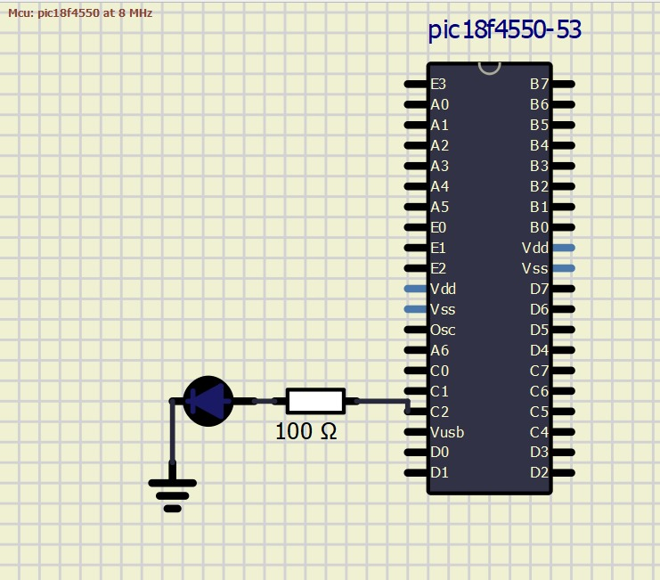
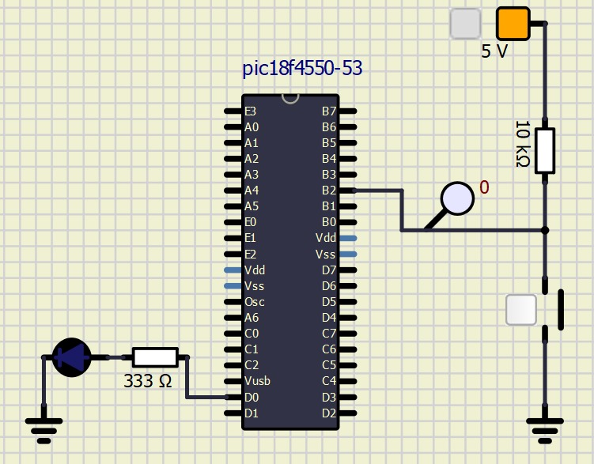
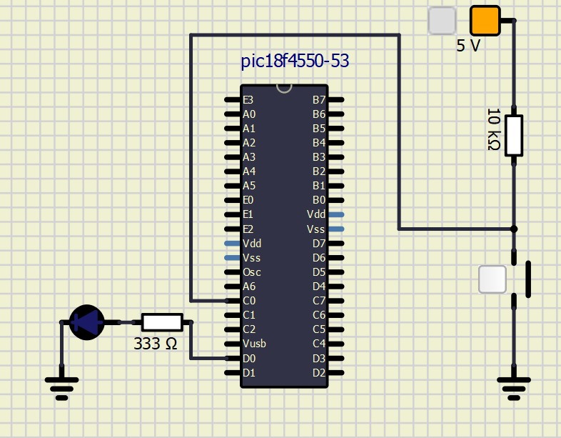

# Atividade Semanal 7

1- Timer
a) TMR0



```c
// Configuração do microcontrolador
void ConfigMCU() {
    // Configurando os pinos como digitais
    ADCON1 |= 0x0F;

    // Configuração das portas
    TRISC = 0;    // PORTD como saída (para usar o LED)
    PORTC = 0;    // LED inicialmente desligado
}

// Configuração do TIMER0
void ConfigTIMER() {
    T0CON = 0b00000110;    // Timer desligado inicialmente, modo timer, prescaler 1:128

    // Carrega valores iniciais para contar 1 segundo
    TMR0L = 0xF7;
    TMR0H = 0xC2;

    INTCON.TMR0IF = 0;    // Zera flag de overflow

    T0CON.TMR0ON = 1;     // Liga o timer
}

void main() {
    // Chamada das funções de configuração
    ConfigMCU();
    ConfigTIMER();

    while (1) {
        // Verifica se houve overflow do timer
        if (INTCON.TMR0IF == 1) {
            // Inverte o estado lógico do LED
            PORTC.RC2 = ~LATC.RC2;

            // Recarga do timer para próximo ciclo (LED pisca a cada 1 segundo)
            TMR0L = 0xF7;
            TMR0H = 0xC2;

            // Zera a flag de overflow
            INTCON.TMR0IF = 0;
        }
    }
}
```

b) TMR3
```c
#include <xc.h>            // Biblioteca padrão para microcontroladores PIC
#include <stdint.h>        // Biblioteca para tipos de dados com tamanhos definidos
#include <stdbool.h>       // Biblioteca para o tipo booleano (true/false)

// Configuração do microcontrolador
void ConfigMCU() {
    // Configura os pinos como digitais
    ADCON1 |= 0x0F;

    // Define a porta como saída para o LED
    TRISC = 0;
    PORTC = 0;    // LED começa desligado
}

// Configuração do TIMER3
void ConfigTIMER() {
    T3CON = 0b10111000;    // Timer inicialmente desligado, modo timer, prescaler 1:8

    // Valores iniciais para contagem de 1 segundo
    TMR3L = 0xF7;
    TMR3H = 0xC2;

    PIR2.TMR3IF = 0;       // Zera a flag de overflow

    T3CON.TMR3ON = 1;      // Liga o timer
}

void main() {
    // Inicializa as configurações
    ConfigMCU();
    ConfigTIMER();

    while (1) {
        // Verifica se houve overflow no timer
        if (PIR2.TMR3IF == 1) {
            // Inverte o estado do LED
            PORTC.RC2 = ~LATC.RC2;

            // Recarrega o timer para repetir o ciclo (LED pisca a cada 1 segundo)
            TMR3L = 0xF7;
            TMR3H = 0xC2;

            // Zera a flag de overflow
            PIR2.TMR3IF = 0;
        }
    }
}
```
c) TMR2

```c
// Configuração do microcontrolador
void ConfigMCU() {
    // Define os pinos como digitais
    ADCON1 |= 0x0F;

    // Configura a porta para uso do LED
    TRISC = 0;    // Define PORTD como saída
    PORTC = 0;    // LED começa desligado
}

// Configuração do TIMER2
void ConfigTIMER() {
    T2CON = 0b01111111;    // Configuração do timer com prescale e postscale

    PR2 = 255;             // Valor máximo para o TIMER2 (2^8)

    PIR1.TMR2IF = 0;       // Zera a flag de overflow, que será 1 ao ocorrer overflow
}

void main() {
    // Inicializa as configurações
    ConfigMCU();
    ConfigTIMER();

    while (1) {
        // Verifica se houve overflow do timer
        if (PIR1.TMR2IF == 1) {
            // Inverte o estado do LED
            PORTC.RC2 = ~LATC.RC2;

            // Zera a flag de overflow
            PIR1.TMR2IF = 0;
        }
    }
}
```

2- Interrupção



a) INT2

```c
#include <xc.h>            // Biblioteca padrão para microcontroladores PIC
#include <stdint.h>        // Biblioteca para tipos de dados com tamanhos definidos
#include <stdbool.h>       // Biblioteca para o tipo booleano (true/false)

// Vetor de interrupção para INT2 (endereço fixo 0x0008)
void __interrupt(high_priority) INT2_ISR(void) {
    // Verifica se a interrupção INT2 ocorreu
    if (INTCON3.INT2IF == 1) {
        // Inverte o estado do LED
        PORTD.RD0 ^= 1;

        // Zera a flag de interrupção e aplica um delay
        INTCON3.INT2IF = 0;
        __delay_ms(40);   // Delay de 40ms
    }
}

// Configuração do microcontrolador
void ConfigMCU() {
    // Configura pinos como digitais
    ADCON1 = 0x0F;

    // Ativa o RBPU (Pull-up Resistor PortB)
    INTCON2.RBPU = 0;

    // Define a porta como saída para o LED
    TRISD = 0;
    PORTD = 0;    // LED inicialmente apagado
}

void main() {
    ConfigMCU();   // Inicializa a configuração do microcontrolador

    // Configuração das interrupções
    INTCON.GIEH = 1;      // Habilita interrupções globais de alta prioridade
    RCON.IPEN = 1;        // Habilita níveis de prioridade

    // Configuração específica para INT2
    INTCON3.INT2IF = 0;   // Zera a flag de interrupção INT2
    INTCON3.INT2IP = 1;   // Define prioridade alta para INT2
    INTCON3.INT2IE = 1;   // Habilita a interrupção INT2

    INTCON2.INTEDG2 = 1;  // Define interrupção na borda de subida (pressionamento da tecla)

    TRISB.RB2 = 1;        // Configura o pino RB2/INT2 como entrada

    while (1) {
        // Loop infinito para manter o programa ativo
    }
}
```



b) TMR1

```c
// Vetor de interrupção de alta prioridade (endereço fixo 0x0008)
void __interrupt(high_priority) TMR1_ISR(void) {
    if (PIR1.TMR1IF == 1) {
        // Inverte o estado do LED após 5 eventos
        PORTD.RD0 ^= 1;

        // Recarrega o timer para nova contagem
        TMR1H = 0xFF;
        TMR1L = 0xFB;

        // Zera a flag de interrupção e aplica um delay
        PIR1.TMR1IF = 0;
        __delay_ms(1000);   // Delay de 1 segundo
    }
}

// Configuração do microcontrolador e do Timer1
void main() {
    // Configurações de prioridade de interrupção
    INTCON.GIEH = 1;       // Habilita interrupções de alta prioridade
    INTCON.GIEL = 1;       // Habilita interrupções de baixa prioridade
    RCON.IPEN = 1;         // Habilita níveis de prioridade

    // Configuração dos pinos digitais
    ADCON1 = 0x0F;         // Define pinos como digitais

    // Configuração do pino T1CKI para contagem externa do Timer1
    TRISC.RC0 = 1;         // Define RC0 como entrada
    PORTC.RC0 = 1;         // Ativa pull-up no pino

    // Configuração da porta do LED
    TRISD = 0;             // Define PORTD como saída
    PORTD = 0;             // LED começa apagado

    // Configuração do Timer1 como contador de 16 bits
    T1CON = 0b10000011;    // Modo contador, ligado a T1CKI com prescaler 1:1

    // Valores iniciais para contar até 5 eventos
    TMR1H = 0xFF;
    TMR1L = 0xFB;

    // Configuração de interrupções do Timer1
    PIR1.TMR1IF = 0;       // Zera a flag de interrupção do Timer1
    IPR1.TMR1IP = 1;       // Define alta prioridade para Timer1
    PIE1.TMR1IE = 1;       // Habilita interrupção do Timer1

    while (1) {
        // Loop infinito para manter o programa ativo
    }
}
```
