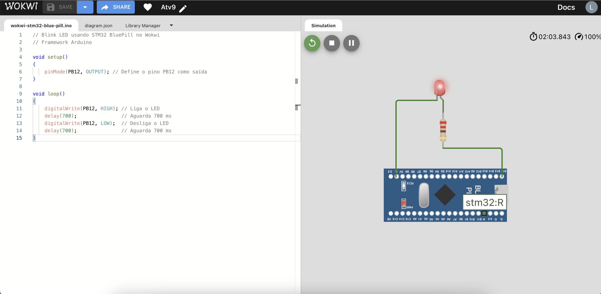

# Atividade Semanal 9

Alunos:
- Lucas Lima Romero (13676325)
- Marco Antonio Gaspar Garcia (11833581)

Questão 1)

Analisando criticamente diferentes arquiteturas de microcontroladores (por meio dos datasheets), faça um breve e sucinto comparativo entre os principais recursos (focar nos mais importantes e essenciais que você consegue observar, com base no contato prévio e recursos utilizados nos projetos anteriores) dos microcontroladores PIC18F4550, STM32F103C8T6 (ou STM32F303VC – escolher um ou outro), e ESP32 WROOM Xtensa Dual Core (versão disponível na placa Devkit)

R: 

| Recurso | PIC18F4550 | STM32F103C8T6 | ESP32 WROOM |
|-------------|-------------|-------------|-------------|
| Arquitetura | 8 bits (Harvard) | 32 bits (ARM Cortex-M3) | 32 bits (Xtensa LX6, Harvard) |
| Clock Máximo | 48 MHz | 72 MHz | 240 MHz |
| Flash | 32 KB | 64 KB | 4 MB |
| RAM | 2 KB | 20 KB | 520 KB SRAM |
| EEPROM | 2256 bytes | Não | Não |
| GPIO | 35 | 37 | 36 | 
| ADC | 10 bits (13 canais) | 12 bits (10 canais) | 12 bits (18 canais) |
| PWM | 2 | 4 | 16 |
| Comunicação | UART, SPI, I2C, USB | UART, SPI, I2C, USB, CAN | UART, SPI, I2C, CAN, Ethernet, Wi-Fi, Bluetooth |
| Tensão de Operação | 2V - 5.5V | 2V - 3.6V | 2.2V - 3.6 V |

Questão 2)

Testar no Wokwi o exemplo demostrado em aula referente ao blink LED na placa BluePill (microcontrolador STM32F103) ou Placa Nucleo C031C6, observando a programação no framework Arduino (e considerações caso fosse utilizado a IDE nativa (Cube IDE)) conforme tutoriais nos slides do Cap. 9.

R:

No Wokwi, é possível testar o exemplo de "blink LED" nas placas BluePill (STM32F103) ou Nucleo C031C6, utilizando o framework Arduino. Este processo envolve criar um código simples para acender e apagar o LED de forma periódica. Além disso, é possível comparar esse método com o uso da IDE Cube IDE, que é mais voltada para o ambiente STM32 e oferece uma interface mais avançada para configurar os periféricos e gerar o código. Embora o Cube IDE seja mais complexo, ele proporciona maior controle sobre o hardware, exigindo que o microcontrolador, os pinos de I/O, o relógio e outros parâmetros sejam configurados antes de escrever o código para o LED blink. Esse processo inicial pode ser mais demorado, mas permite um nível mais detalhado de personalização.

<figure>
  
  <figcaption>Figura 1:  Simulação Wokwi de Blink LED na Placa STM32F103.</figcaption>
</figure>

O código referente a figura acima é o seguinte:

```c
// Blink LED usando STM32 BluePill no Wokwi
// Framework Arduino

void setup()
{
    pinMode(PB12, OUTPUT); // Define o pino PB12 como saída
}

void loop()
{
    digitalWrite(PB12, HIGH); // Liga o LED
    delay(700);               // Aguarda 700 ms
    digitalWrite(PB12, LOW);  // Desliga o LED
    delay(700);               // Aguarda 700 ms
}
```

Questão 3)

Demostrar como acionar a saída PC13 (LED onboard na BluePill) a partir da programação “bare-metal” por meio da configuração direta de registradores (apresentar apenas as linhas de código e explicações sobre a configuração dos registradores envolvidos - não é necessário testar na placa, nem usar a IDE ou simulador)

R:

Este código mostra como controlar diretamente o pino PC13 da BluePill com a programação bare-metal, sem usar bibliotecas ou IDEs.

```c
# define RCC_BASE 0 x40021000 // Base do RCC
# define GPIOC_BASE 0 x40011000 // Base do GPIOC

# define RCC_APB2ENR (*( volatile unsigned int *)( RCC_BASE + 0 x18 )) // Habilita o clock APB2
# define GPIOC_CRH (*( volatile unsigned int *)( GPIOC_BASE + 0 x04 )) // Configuracao dos pinos 8 -15
# define GPIOC_BSRR (*( volatile unsigned int *)( GPIOC_BASE + 0 x10 )) // Set / Reset atomico dos pinos
# define GPIOC_BRR (*( volatile unsigned int *)( GPIOC_BASE + 0 x14 )) // Reset atomico dos pinos

void main ( void ) {
    // 1. Habilitar o clock para GPIOC
    RCC_APB2ENR |= (1 << 4); // Setar bit 4 para habilitar GPIOC no APB2

    // 2. Configurar PC13 como saida push - pull com velocidade de 2 MHz
    GPIOC_CRH &= ~(0 xF << 20); // Limpa os 4 bits referentes ao pino PC13
    GPIOC_CRH |= (0 x2 << 20); // Configura : 0 b0010 ( Output , push -pull , 2 MHz )

    // 3. Loop principal para alternar o estado de PC13
    while (1) {
        GPIOC_BSRR = (1 << 13); // Liga PC13 (Set bit 13)
        for ( volatile int i = 0; i < 100000; i ++); // Delay ( simples loop )

        GPIOC_BRR = (1 << 13); // Desliga PC13 ( Reset bit 13)
        for ( volatile int i = 0; i < 100000; i ++); // Delay ( simples loop )
    }
}
```