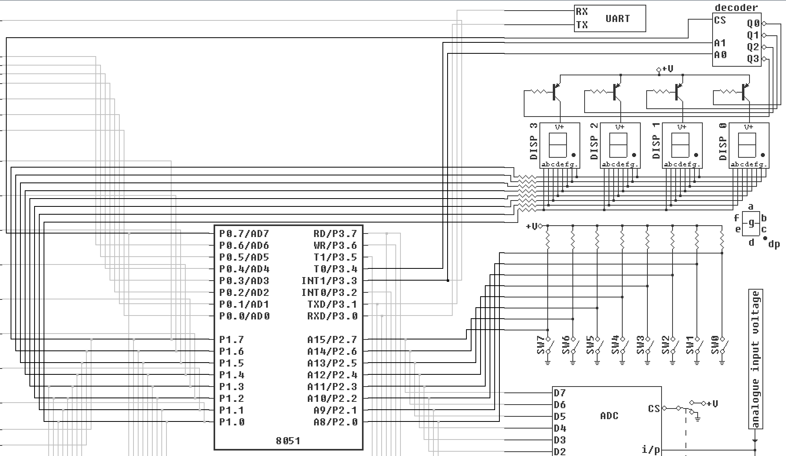
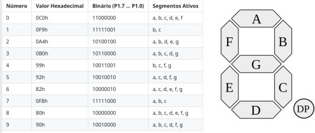

# Projeto 1 - Cronômetro Digital usando Assembly e 8051

Alunos:
- Lucas Lima Romero (13676325)
- Luciano Gonçalves Lopes Filho (13676520)
- Marco Antonio Gaspar Garcia (11833581)

## Introdução
O projeto apresentado visa desenvolver um cronômetro digital com intervalo variável, utilizando linguagem Assembly. Para isso, foi utilizado o simulador EdSim51DI, que replica um microcontrolador da família 8051.

### Especificações
- Ao pressionar o botão **SWO**, o cronômetro deve realizar uma contagem de 0 a 9 com intervalo de 0,25s.
- Ao pressionar o botão **SW1**, a contagem passa a ser realizada com intervalo de 1s.
- Ao executar o programa, a contagem não se inicia, e o display estará desligado, até que **SW0** ou **SW1** sejam pressionados.
- Caso o usuário desative os botões, o display apaga, zerando a contagem.
- Caso ambos os botões estejam pressionados, prevalece o intervalo referente ao **SW0**.

### Diagrama - 8051

<figure>
  
  <figcaption>Figura 1: Diagrama retirado do próprio EdSim51DI, o projeto utiliza apenas as linhas escuras.</figcaption>
</figure>

Na figura acima, é possível ver as ligações utilizadas no projeto, em traços mais escuros. Pode-se ver o banco de Switches, assim como os quatro displays de sete segmentos disponíveis no simulador. Percebe-se que ambos estão conectados diretamente à alimentação (+U), por isso, quando queremos ativar o switch ou um segmento do display, utilizamos o nível lógico baixo (GND). 

A porta **P1** concentra os displays de sete segmentos. Como existem quatro displays disponíveis, é possível chavear entre eles. Entretanto, no projeto, utilizamos apenas o primeiro display. Cada um dos pinos da porta acende um segmento, nomeados de "a" a "g", assim como o ponto decimal "dp". Para exibir um número específico no  display, deve-se mover a combinação exata de "0" e "1", que acendem o e apagam os segmentos desejados. Na figura abaixo, pode-se ver uma tabela com os valores binários e hexadecimais correspondentes.

<figure>
  
  <figcaption>Figura 2: Tabela de valores referentes ao display de 7 segmentos.</figcaption>
</figure>

Já na porta **P2**, podemos ver os switches. Assim como o display, estão conectados à alimentação (+U), entremeada pelos resistores de Pull-Up. Neste projeto, apenas os botões 0 e 1 serão utilizados. O delay entre a exibição dos números no display deve ser diferente, em vista do switch acionado.

## O Código
O programa inicia atribuindo nome e valores à constantes, que serão importantes ao longo do código, além da definição da tabela de números hexadecimais correspondentes aos números no display, vista na figura 2. 

```
org 0000h               ; Define o início do programa

; Nomeando as variáveis
SW EQU P2               ; Nomeia a porta P2
SW0 EQU P2.0            ; Nomeia a chave 0
SW1 EQU P2.1            ; Nomeia a chave 1
DISPLAY EQU P1          ; Nomeia a porta P1
MOV SP, #04Fh 			; Move o StackPointer para uma região distante
MOV DPTR, #database	    ; Aponta DPTR para o início do array 'display'

database:
db 0C0h		; Valor para o número 0 no display
db 0F9h		; Valor para o número 1 no display
db 0A4h		; Valor para o número 2 no display
db 0B0h		; Valor para o número 3 no display
db 99h		; Valor para o número 4 no display
db 92h		; Valor para o número 5 no display
db 82h		; Valor para o número 6 no display
db 0F8h		; Valor para o número 7 no display
db 80h		; Valor para o número 8 no display
db 90h		; Valor para o número 9 no display

```
O trecho de código a seguir é responsável por limpar o display e aguardar o acionamento de algum switch. Sempre que não existem switches acionados, este trecho é chamado. Uma vez que todos os switches estão em nível lógico alto quando desativados, a verificação do acionamento é feita de maneira simples:
1. Move para o acumulador o valor máximo (#0FFh ou #11111111b)
2. Subtrai A do valor atual de SW
3. Caso o resultado seja maior que zero, existe um switch ativado

```
CLEAR: ; Limpa o display
	MOV DISPLAY, #0FFh 
STANDBY: ; Verificar se algum switch está pressionado
	CLR CY				; Limpa o carry
	MOV A, #0FFh		; Atribui o valor máximo ao Acumulador
	SUBB A, SW		    ; Realiza a subtração do valor máximo com o valor atual nos Switches 
	JZ STANDBY		    ; se A != 0, passa reto, senão, volta ao loop
	MOV R0, #0		    ; Atribui R0 com 0, será o número a ser mostrado
```
A seguir, tendo pelo menos um switch acionado, o código entra no loop principal de exibição dos números no display, guiada pelo registrador R0. Este registrador irá guardar o número a ser mostrado no display, iniciando no 0, e é passado para o acumulador. Então, comando MOVC A, @A+DPTR é responsável por buscar na tabela apontada por DPTR a linha de dados referente ao valor de A. Como A é zero, em um primeiro momento, A passa a ter o número contido na primeira linha da tabela ao fim da execução desta instrução. Como visto anteriormente, DPTR foi apontado para o início da tabela (ou array) que continha os valores a serem enviados ao display em hexadecimal, e A é reponsável por iterar sobre cada item dessa tabela, a cada chamada do MAIN_LOOP. Então, o número contido em A é enviado ao display, exibindo o número correspondente decimal.

 Depois de mostrar o primeiro número, chama-se a sub-rotina de delay. Passado o tempo de delay, novamente é verificado se existe algum switch pressionado, para poder parar o loop caso isso aconteça. O procedimento é feito da mesma forma do bloco anterior. Caso ainda existam switches pressionados, o valor de R0 é incrementado e o programa volta ao início do loop, para mostrar o próximo número no display. Por fim, quando R0 atinge o valor 10, ele é zerado e o loop reinicia com R0 igual à 0. 

```
; Este loop acende o display
MAIN_LOOP:
	MOV A, R0				; R0 será o índice, o número a ser mostrado
	MOVC A, @A+DPTR	        ; Carrega o valor da tabela 'display' (com base no índice) em A
	MOV DISPLAY, A		    ; Mostra o número no display
    
	CALL DELAY			    ; Chama a rotina de delay
	
	; Verifica se algum switch ainda está pressionado com um procedimento igual ao anterior
	CLR CY
	MOV A, #0FFh
	SUBB A, SW
	JZ CLEAR 	            ; Caso sim, limpa o display e retorna ao Standby, cancelando o loop

	INC R0	                ; Incrementa o índice para o próximo número
	CJNE R0, #10, MAIN_LOOP	; Continua se o índice for menor que 10 (0 a 9)

	; Quando a contagem chega a 10, reinicia-se o loop
	MOV R0, #0
	SJMP MAIN_LOOP	
```
Por fim, é necessário atribuir um delay diferente baseado no switch pressionado. Por isso, na sub-rotina de delay devem haver verificações desse tipo. Caso o switch seja o SW0, a sub-rotina gasta aproximadamente 250ms (escrita com base em uma sub-rotina fornecida pelo professor, que gastava 50ms). Caso seja SW1, essa rotina é repetida 4 vezes, totalizando 1s, aproximadamente.

```
; Sub-rotina de delay: 250ms ou 1s
DELAY:
	MOV R4, #4					
DELAY_LOOP_3:
	MOV R3, #5            
DELAY_LOOP_2:
	MOV R2, #100          
DELAY_LOOP_1:
	MOV R1, #250          
DELAY_LOOP_0:
	DJNZ R1, $            
	DJNZ R2, DELAY_LOOP_1 
	DJNZ R3, DELAY_LOOP_2 
	JNB SW0, RETURN			    ; Caso SW0 estiver pressionado, acaba aqui
	JB SW1, RETURN				; Caso SW1 não esteja pressionado, encerra tudo	
	DJNZ R4, DELAY_LOOP_3	    ; Caso SW1 esteja pressionado, repete 4 vezes (250ms x 4)
RETURN:
	RET   
```

O código na íntegra pode ser visto em *~/Projetos/1/Projeto1.asm*.